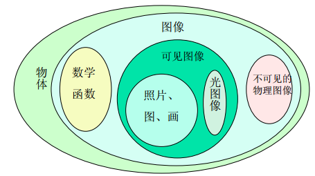
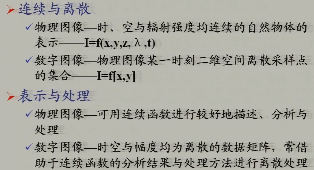
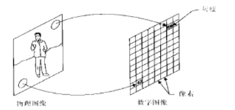
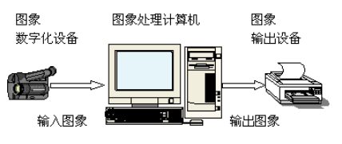
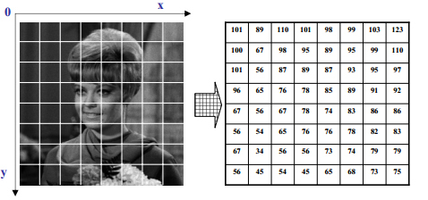
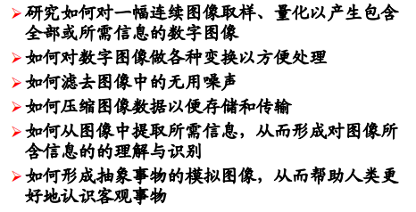
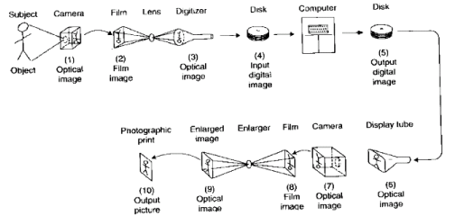

# DIP_01_概论

>数字图像处理源于两个主要的领域：
>
>​	改善图像信息以便于人们解释
>
>​	为存储传输和表示而对图像数据进行处理，以便于机器自动理解

## 什么是图像 

1. `图`是物体投射或反射光的分布
2. `像`是人的视觉系统对图的接收在大脑中形成的印象或者反映
3. **图像是一个东西的另一种表示形式**，是对所表示信息的浓缩和高度概括
4. 是客观和主观的结合
5. 图像是对客观存在物体适当的表示

### 蒙娜丽莎的人眼识别过程

待续....

## 数字图像处理

### 模拟图像

- `I =f(x,y,z,λ,t) `
  - 三维空间连续
  - 时间上连续
  - 波谱上连续
  - 不可见物理图像
  - 想象中的虚拟图像

### 图像分类

### 数字图像

**模拟图像的数字化**

三维空间数字化  二维图像

时间离散化          多维图像

层次数字化          灰度数字化

波谱数字化          从波普角度拓展到人类观察自然间的能力

尺度适度化          从空间尺度拓展人类观察自然界的能力

**数字图像处理预分析的哲学方法**

一幅数字图像可以被定义为一个二维数组`f(x,y)`,其中：

- `x and y `为空间坐标
- `f(x,y)` 在任意坐标处的幅值称之为该点处图像的亮度或者灰度 
- 当`x y f(x,y)`为有限 离散值，称之为数字图像

数字图像处理就是用计算机来处理数字图像：

- 数字图像是由有限的元素组成，每一个元素都有特殊的位置和数值，这些元素称之为像素。

- 像素是广泛用于定义数字图像元素的术语。

- 数字图像处理系统基本构成：

  

我们现在视觉所感知的图像被限制在电磁波谱的可见光频段；但是现有的成像机器几乎覆盖了电磁波频谱的所有波段：从伽马射线(最高能量)到无线电波(最低能量)；数字图像处理包含很宽的应用领域。

图像分析领域介于图像处理和计算视觉之间。

#### 数字图像表示-二维矩阵

## 图像处理的三个阶段

- 低级阶段：
  - 原始操作，如预处理 对比度增强 和图像锐化
  - 特点：输入和输出均为图像
- 中级操作：
  - 分割 提取
  - 特点：输入为图像，输出则是这些图像中提取的属性
- 高级操作：
  - 特点：通过执行与人类视觉先关的感知函数，来对识别的对象进行总体的确认

## 学习部分

- 图像变换

- 图像编码

- 图像增强和恢复

- 图像分割

- 图像的理解和识别

  **数字图像处理**不是指“处理数字图像”，而是指“图像的数字处理”

方法前提：

- 能够刻画对连续形式的图像进行离散化后的影响
- 寻求从模拟到数字，再到数字到模拟的转换过程中，保证我们感兴趣的内容不丢失或者不明显损失的方法。

## 数字图像与分析的定义

**对一个物体的数字化表示** ---- **二维矩阵** ---- **施加一系列的操作，已得到所期望的结果**

## 入门选取Matlab

- 容易学习
- 用OpenCV容易掉进调用API的陷阱
- 可以快速生成所需要的代码模型
