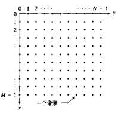
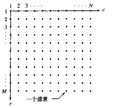
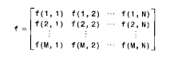

# 基本原理

> MATLAB为数字图像处理带来了一套广泛的函数
>
> 这些函数可以处理多维数字
>
> 图像(二维数组)是多维数组的一种特例
>
> IPT工具箱(Image Processing ToolBox)

## 数字图像的表示方法

图像可以被定义为一个二维函数`f(x,y)`

- 其中`x,y`是空间坐标
- `f(x,y) `在坐标`（x,y）`处的振幅称之为该图像在该点的亮度

灰度表示黑白图像亮度的一个术语；

彩色图像是由单个二维图像组合形成的

- 在RGB图像中，一幅彩色图像是由三幅独立分量图像组合而成的
- 所以处理黑白图像的开发技术适用于彩色图像处理

将一幅模拟数字图像转变为离散数字图像，需要经过两个阶段：

- 坐标值数字化的过程称之为**取样**
- 将振幅数字化称之为**量化**

## 数字图像的坐标表示

对一幅图像进行取样和量化操作后，得到一幅有着MxN的图像。此时有两种坐标约定：

- 多数书籍中的约定：

  - 坐标点使用`（x,y）`来表示
  - 坐标的取值从0开始

  

- 工具箱中用的坐标约定有两点不同：

  1. 坐标使用`(r,c)`来表示

  2. 坐标的取值从1开始

     

Matlab中的图像坐标表示：

## 数字图像的读取

