# 数字图像处理基础

> 1. 图像的表示
> 2. 图像的质量
> 3. 人类视觉模型
> 4. 图像的颜色
> 5. 图像的描述
> 6. 图像的直方图
> 7. 图像的数字化

## 图像的表示

### 简单的图像形成模型

我们可以使用`f(x,y)`的二维函数来表示图像

当一幅图像有物理过程产生是，其亮度值正比于物理源所辐射的能量，因此`f(x,y)`一定是非零的和有限的。

`0 < f(x,y) < 正无穷`

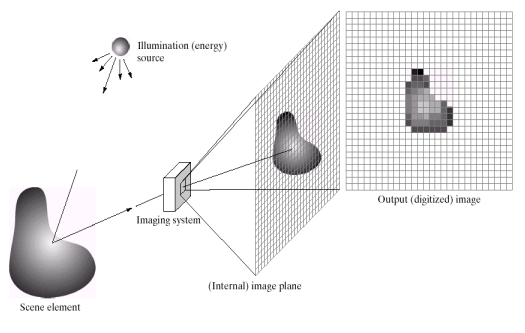

过程：

1. 能量（照明）源照射物体
2. 物体元素反射光线到成像系统中
3. 成像系统形成场景到图像平面的投影
4. 然后输出为数字化后的图像（二维数组）

### 数字图像的基本要素-像素

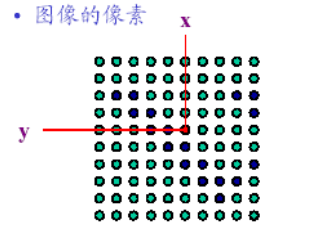

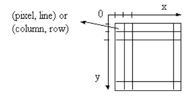

**像素值：对单个像素灰度值进行数字化采样**

### 图像是由矩阵表示的

- 图像是像素的二维排列
- 一般采用均匀采样
  - 像素行列之间间隔相等
  - 二维排列形成一个矩阵
- 特殊情况下，也可采用非均匀采样

### 图像的数学表示

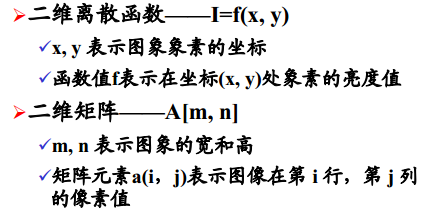

## 图像的质量

### 灰度

- 灰度：表明图像像素明暗程度的数值
- 灰度级：表明图像中不同灰度的最大数量

**图像数据的实际灰度值越多，图像的数据效果越好**

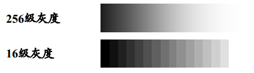

### 对比度

反映一幅图像中灰度方差的大小

对比度 = 最大灰度值/最小灰度值

### 图像质量评价

- 主观评价
- 客观评价

### 图像的颜色

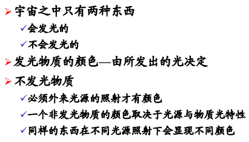

### RGB三基色

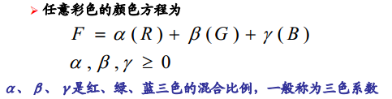

### 颜色空间

- `R G B`
  - 主动产生颜色光源
- CMYK(青品红黄黑)
  - 用于印刷 绘画等
- `H S I`色调`（Hue）` 饱和度`（Saturation）` 亮度`(Intensity)`
  - 用于调整颜色分量

一幅图像在计算机中用RGB或者HSI空间显示；打印输出时要转换为CMY空间；印刷时要转换为CMYK印刷分色图，用于套印彩色印刷品

#### RGB空间（相加混色）

- RGB颜色模型为三维直角坐标颜色系统中的一个顶点的三条边
- 在正方体的对角线上，各原色相等，产生从暗到亮的白色

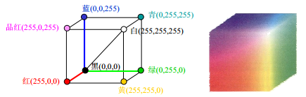

#### CMY模型-相减混色

与RGB模型正好互补

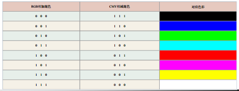

### HSI颜色模型

- 从人的视觉系统出发，使用色调 饱和度 亮度来描述色彩
- 比RGB模型更能够符合人的视觉特性
- HSI模型可以进行分开处理而且相互独立
- HSI模型大大简化了图像分析和处理的工作量
- HSI和RGB模型存在转换关系

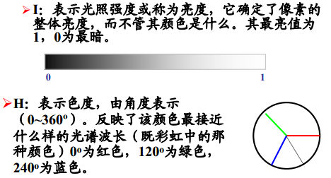

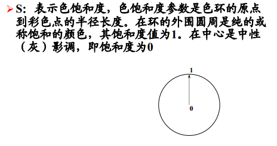

`HSI`的圆锥空间模型:

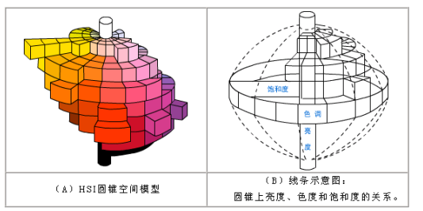

### 颜色模型转化

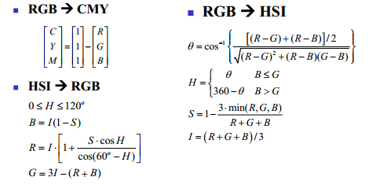

## 图像的描述

- 黑白图像（二值图像）

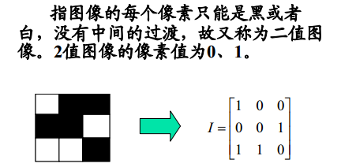

- 灰度图像

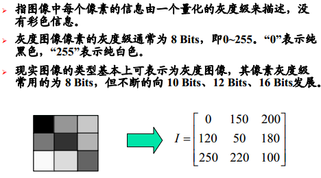

- 彩色图像

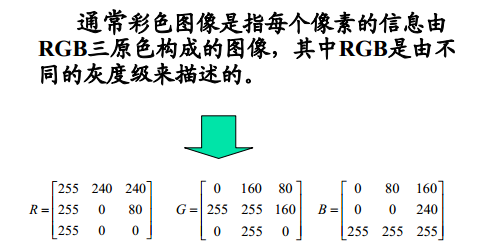

## 图像的矩阵特性

### 距离

两个像素之间的距离度量

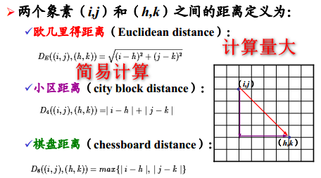

### 像素的邻域描述

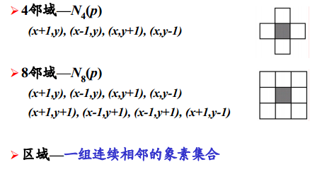

### 像素的统计特性

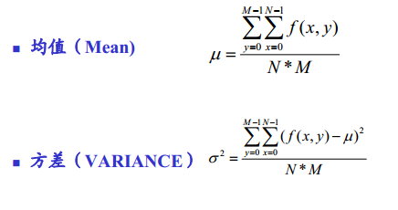

## 图像文件格式

待续...

## 图像的采样和量化

待续

